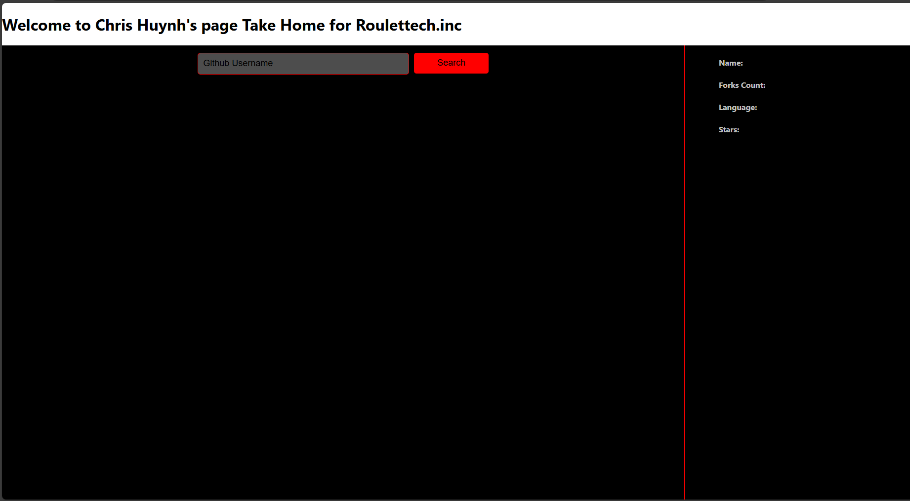
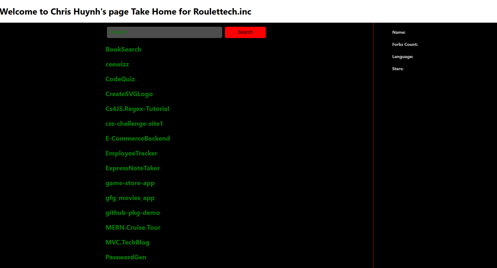
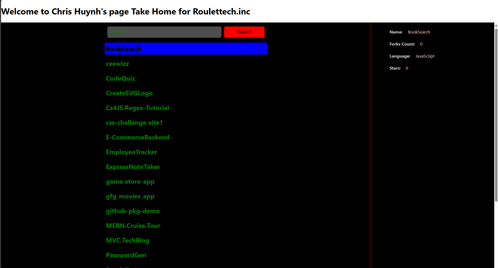
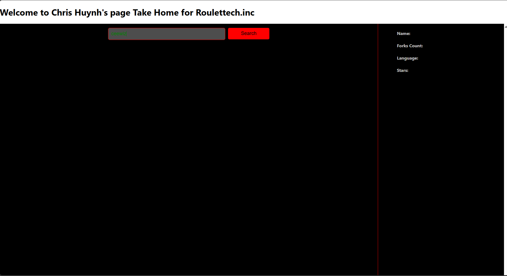
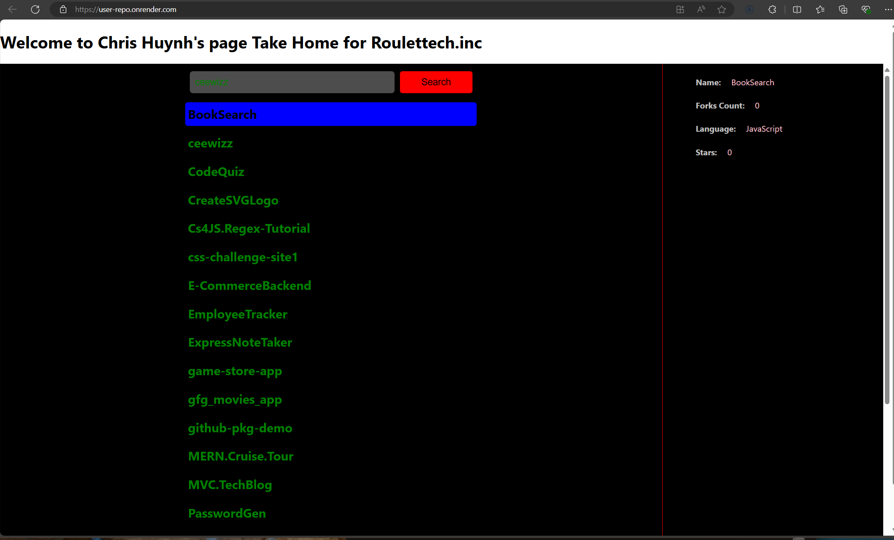

## Introduction
React Page that searches for user's Github Page displaying all their Repositories.

### Description
When loading up the page there will be input placeholder where user can input any username from github and then after clicking on the Search button, the user's github page will load displaying all their repositories. By selecting a repository in a user's Github page,  a Repo details will display on the right side of the page it will display the Name of the project, how many times the project had been forked. The programming language that was used to create the project and lastly how many stars the project receives. By hitting the backspace on the keyboard or the username of a Github's user is mispelled the whole page including the Name: Fork Count: Language: and Stars: will clear out. When inserting random characters into the Github Username input box and then click on the search button, the page will load an error with an error message.Simply refresh the page.

#### Credit
Written by Chris Huynh

##### Screenshots

Screenshot of public website accessibility

## Links
Github Repo: https://github.com/ceewizz/user_repo

Deploy Link: https://user-repo.onrender.com/

# Getting Started with Create React App

This project was bootstrapped with [Create React App](https://github.com/facebook/create-react-app).

## Available Scripts

In the project directory, you can run:

### `npm start`

Runs the app in the development mode.\
Open [http://localhost:3000](http://localhost:3000) to view it in your browser.

The page will reload when you make changes.\
You may also see any lint errors in the console.

### `npm test`

Launches the test runner in the interactive watch mode.\
See the section about [running tests](https://facebook.github.io/create-react-app/docs/running-tests) for more information.

### `npm run build`

Builds the app for production to the `build` folder.\
It correctly bundles React in production mode and optimizes the build for the best performance.

The build is minified and the filenames include the hashes.\
Your app is ready to be deployed!

See the section about [deployment](https://facebook.github.io/create-react-app/docs/deployment) for more information.

### `npm run eject`

**Note: this is a one-way operation. Once you `eject`, you can't go back!**

If you aren't satisfied with the build tool and configuration choices, you can `eject` at any time. This command will remove the single build dependency from your project.

Instead, it will copy all the configuration files and the transitive dependencies (webpack, Babel, ESLint, etc) right into your project so you have full control over them. All of the commands except `eject` will still work, but they will point to the copied scripts so you can tweak them. At this point you're on your own.

You don't have to ever use `eject`. The curated feature set is suitable for small and middle deployments, and you shouldn't feel obligated to use this feature. However we understand that this tool wouldn't be useful if you couldn't customize it when you are ready for it.

## Learn More

You can learn more in the [Create React App documentation](https://facebook.github.io/create-react-app/docs/getting-started).

To learn React, check out the [React documentation](https://reactjs.org/).

